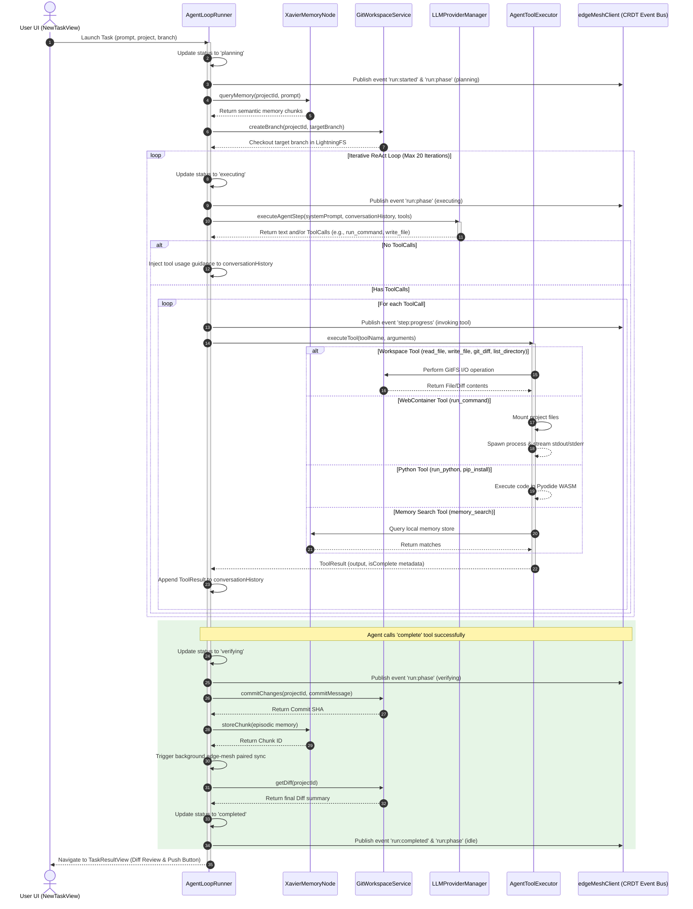
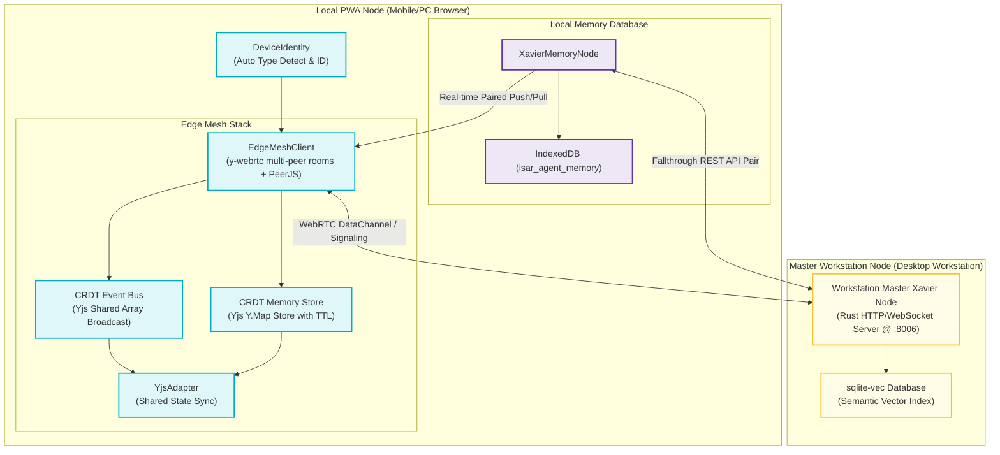
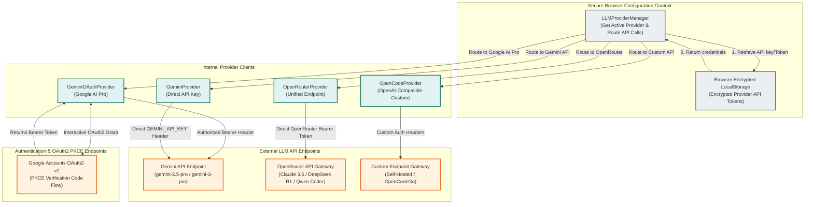

# 🏗️ SWAL Agent Runner — Architectural Diagrams & Technical Design

> **Protocol Version:** v3.9.0
> **Documentation Scope:** System Components, Execution Runtimes, Local Git Workspace, and WebRTC P2P Memory Mesh

This document provides a comprehensive technical overview and visualization of the **SWAL Agent Runner** architecture. As a zero-desktop-dependency Progressive Web App (PWA), the system achieves full PC and mobile parity by operating execution environments, memory systems, and version control entirely within the browser context.

---

## 1. High-Level Component Topology

The architecture is divided into five distinct planes, coordinating local browser capabilities (WebContainers, Pyodide, LightningFS) with decentralized real-time memory synchronization and multi-provider LLM orchestration.

```mermaid
graph TD
    %% Styling and classes
    classDef ui fill:#e3f2fd,stroke:#1565c0,stroke-width:2px,color:#0d47a1;
    classDef core fill:#e8f5e9,stroke:#2e7d32,stroke-width:2px,color:#1b5e20;
    classDef runtime fill:#fff3e0,stroke:#ef6c00,stroke-width:2px,color:#e65100;
    classDef storage fill:#f3e5f5,stroke:#6a1b9a,stroke-width:2px,color:#4a148c;
    classDef external fill:#ffebee,stroke:#c62828,stroke-width:2px,color:#b71c1c;

    subgraph UI_Layer ["1. User Interface Plane (React 19 & Tailwind v4)"]
        ProjectsView["ProjectsView<br/>(Repo Dashboard)"]:::ui
        NewTaskView["NewTaskView<br/>(Task Spec & Launcher)"]:::ui
        TaskProgressView["TaskProgressView<br/>(Live Loop Monitor)"]:::ui
        TaskResultView["TaskResultView<br/>(Diff & Commit Review)"]:::ui
        MeshPanel["MeshPanel<br/>(Device & Peer Manager)"]:::ui
        AuthSettingsModal["AuthSettingsModal<br/>(Encrypted Credentials)"]:::ui
    end

    subgraph Core_Plane ["2. Core Agent Control Plane"]
        AgentLoopRunner["AgentLoopRunner<br/>(ReAct Controller Loop)"]:::core
        AgentToolExecutor["AgentToolExecutor<br/>(Tool Command Dispatcher)"]:::core
        LLMProviderManager["LLMProviderManager<br/>(Provider Route & Auth Store)"]:::core
        edgeMeshClient["edgeMeshClient<br/>(Multi-Peer mesh interface)"]:::core
    end

    subgraph Runtime_Plane ["3. Headless Execution Runtimes"]
        WebContainerRunnerService["WebContainerRunner<br/>(WASM Node.js Runtime)"]:::runtime
        PythonRunnerService["PythonRunner<br/>(Pyodide WASM Runtime)"]:::runtime
        GestaltWorker["GestaltWorker<br/>(Web Worker WASM Bridge)"]:::runtime
    end

    subgraph Storage_Plane ["4. Storage & Version Control Plane"]
        GitWorkspaceService["GitWorkspaceService<br/>(Workspace & Git Orchestrator)"]:::storage
        LightningFS["LightningFS<br/>(IndexedDB Virt Filesystem)"]:::storage
        IsomorphicGit["isomorphic-git<br/>(WASM Git Engine)"]:::storage
        XavierMemoryNode["XavierMemoryNode<br/>(IndexedDB Vector Memory)"]:::storage
    end

    subgraph External_Plane ["5. External Integration Plane"]
        RemoteGit["Remote Repository<br/>(GitHub / GitLab)"]:::external
        CorsProxy["SWAL CORS Proxy<br/>(HTTP Gateway)"]:::external
        XavierMaster["Xavier Workstation Master<br/>(Rust / sqlite-vec @ :8006)"]:::external
        LLM_Providers["LLM Providers<br/>(Google AI Pro / OpenRouter / OpenCodeGo)"]:::external
    end

    %% UI Interactions
    ProjectsView --> GitWorkspaceService
    NewTaskView --> AgentLoopRunner
    TaskProgressView --> AgentLoopRunner
    TaskResultView --> GitWorkspaceService
    MeshPanel --> edgeMeshClient
    AuthSettingsModal --> LLMProviderManager

    %% Agent Interactions
    AgentLoopRunner --> LLMProviderManager
    AgentLoopRunner --> AgentToolExecutor
    AgentLoopRunner --> XavierMemoryNode
    AgentLoopRunner --> edgeMeshClient

    %% Tool Dispatch
    AgentToolExecutor --> GitWorkspaceService
    AgentToolExecutor --> WebContainerRunnerService
    AgentToolExecutor --> PythonRunnerService
    AgentToolExecutor --> XavierMemoryNode

    %% Runtime / Storage Interactions
    WebContainerRunnerService -.-> LightningFS : "Sync Files (Mount)"
    GitWorkspaceService --> IsomorphicGit
    IsomorphicGit --> LightningFS

    %% External Connections
    IsomorphicGit --> CorsProxy
    CorsProxy --> RemoteGit
    LLMProviderManager --> LLM_Providers
    XavierMemoryNode --> XavierMaster : "Real-Time / Paired WebRTC Sync"
    edgeMeshClient <--> XavierMaster : "WebRTC edge-mesh Channel"
```

---

## 2. ReAct Agent Loop & Telemetry Flow

The **ReAct Execution Loop** operates autonomously through iterative prompts. It handles tool execution, live telemetry streaming, and updates status values upon completion.



---

## 3. Git Workspace and Local Filesystem Data Flow

To preserve PWA accessibility on sandbox-constrained environments like Android Chrome, the runner implements a fully simulated local Git filesystem backed by IndexedDB.

```mermaid
graph TD
    subgraph Browser_Sandbox ["Browser Sandbox (PC & Mobile)"]
        UI_Trigger["ProjectsView / TaskResultView"]

        subgraph Git_Workspace_Control ["Git Workspace System"]
            GitService["GitWorkspaceService"]
            IsomorphicGit["isomorphic-git WASM Engine"]
            LightningFS["@isomorphic-git/lightning-fs"]
        end

        subgraph Runtime_Isolation ["Runtime Isolation Plane"]
            WebContainerFS["WebContainer Virtual Filesystem"]
            WebContainerProc["Node.js Process (e.g., npm test)"]
        end

        subgraph Storage_Engine ["Storage Engine"]
            IndexedDB_FS["IndexedDB (LightningFS Tables)"]
        end
    end

    subgraph External_Network ["External Network"]
        Proxy["SWAL CORS Proxy"]
        Remote["Remote Git Repository (GitHub/GitLab)"]
    end

    %% Workflows
    %% Clone/Fetch Flow
    UI_Trigger -->|1. Request Clone| GitService
    GitService -->|2. Command Clone| IsomorphicGit
    IsomorphicGit -->|3. Route Git Protocol| Proxy
    Proxy -->|4. Forward Request| Remote
    Remote -->|5. Return packfile/refs| Proxy
    Proxy -->|6. Unpack| IsomorphicGit
    IsomorphicGit -->|7. Write Files| LightningFS
    LightningFS -->|8. Persist Block-Store| IndexedDB_FS

    %% Command Execution File Sync
    GitService -->|9. run_command Trigger| WebContainerFS
    LightningFS -->|10. Mount Files (Read)| WebContainerFS
    WebContainerFS -->|11. Execute Script| WebContainerProc
    WebContainerProc -->|12. Write Output/Artifacts| WebContainerFS
    WebContainerFS -.->|13. Synchronize Changes| LightningFS

    %% Commit/Push Flow
    UI_Trigger -->|14. Approve Commit & Push| GitService
    GitService -->|15. Stage & Commit| IsomorphicGit
    IsomorphicGit -->|16. Push Command| Proxy
    Proxy -->|17. Authenticated Git Push| Remote
```

---

## 4. Real-Time P2P WebRTC Memory Sync & Mesh Networking

Sovereign memory is managed locally via vector chunks and paired dynamically with the primary desktop workstation via **`edge-mesh` P2P WebRTC connection**, synchronizing Yjs-backed CRDT graphs.



---

## 5. Multi-LLM Routing and Token Flow

The Multi-LLM Engine provides adaptive routing across providers, managing PKCE OAuth2 flows, API keys, and model configuration securely.



---
*SWAL GitCore Protocol v3.9.0*
