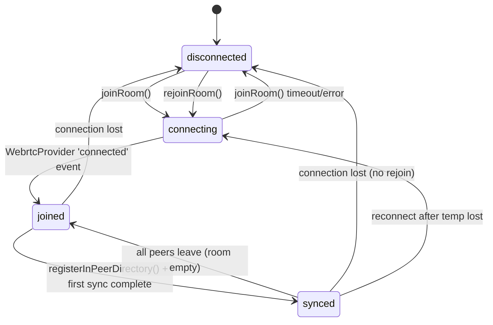

# Multi-Peer Mesh Extension — Design Document

**Status:** Draft  
**Author:** Hermes Agent (subagent)  
**Date:** 2026-07-29  
**Target:** swal-agent-runner PWA  

---

## Table of Contents

1. [Problem & Scope](#1-problem--scope)
2. [Current Architecture (Baseline)](#2-current-architecture-baseline)
3. [Target Architecture](#3-target-architecture)
4. [1. Extending EdgeMeshClient for N-Peer Room Membership](#4-1-extending-edgemeshclient-for-n-peer-room-membership)
5. [2. Wiring initCrdtSync into App Startup](#5-2-wiring-initcrrdsync-into-app-startup)
6. [3. Peer Discovery Within y-webrtc Room](#6-3-peer-discovery-within-y-webrtc-room)
7. [4. Device Identity & Node Registration](#7-4-device-identity--node-registration)
8. [5. Migration Path: PeerJSTransport → y-webrtc](#8-5-migration-path-peerjstransport--y-webrtc)
9. [6. State Machine for Connection States](#9-6-state-machine-for-connection-states)
10. [7. File Island Mapping & Risk Assessment](#10-7-file-island-mapping--risk-assessment)
11. [Implementation Phasing](#11-implementation-phasing)

---

## 1. Problem & Scope

### Problem
EdgeMeshClient (`edge-mesh-client.ts`, 125 lines) is designed exclusively for **1:1 pairing** (phone ↔ PC). It holds one `ITransport`, one `_paired` boolean, and one `_peerEndpoint` string. The y-webrtc sync function (`initCrdtSync` in `crdt-sync.ts`) exists but is **completely unwired** — zero imports in the app lifecycle. The PWA cannot join a multi-device mesh.

### Goal
Enable **N-node mesh** (phone + tablet + PC + laptop all connected simultaneously) using y-webrtc rooms for CRDT sync, with offline-first persistence via y-indexeddb, and a clean migration from the existing PeerJS transport.

### Non-Goals (Phase 0)
- Not replacing the ITransport interface for non-mesh use cases
- Not building a custom signaling server (reuse y-webrtc defaults)
- Not adding end-to-end encryption on top of y-webrtc (password is sufficient)

---

## 2. Current Architecture (Baseline)

```
┌────────────────────────────────────────────────────────┐
│                     App.tsx                             │
│  ┌─────────────────────────────────────────────────┐   │
│  │ PairingView (UI)                                │   │
│  │   └─ dynamic import → PeerJSTransport            │   │
│  │   └─ edgeMeshClient.setTransport(transport)      │   │
│  └─────────────────────────────────────────────────┘   │
│  ┌─────────────────────────────────────────────────┐   │
│  │ edgeMeshClient (singleton)                       │   │
│  │  ├─ transport: ITransport | null                 │   │
│  │  ├─ _paired: boolean                             │   │
│  │  ├─ _peerEndpoint: string                        │   │
│  │  ├─ _yjs: YjsAdapter                            │   │
│  │  ├─ events: EventTarget                          │   │
│  │  ├─ crdtEventBus: CrdtEventBus (lazy)           │   │
│  │  ├─ setTransport(t) → onPeerConnected/Disconnected│  │
│  │  └─ subscribe(listener)                          │   │
│  └─────────────────────────────────────────────────┘   │
│  ┌─────────────────────────────────────────────────┐   │
│  │ initCrdtSync() — ZERO IMPORTS ✗                 │   │
│  └─────────────────────────────────────────────────┘   │
└────────────────────────────────────────────────────────┘
```

### Key Files

| File | Lines | Role |
|------|-------|------|
| `edge-mesh-client.ts` | 125 | Singleton P2P client, 1:1 transport holder |
| `transport.ts` | 156 | ITransport interface + PeerJSTransport + MemoryTransport |
| `crdt-sync.ts` | 63 | `initCrdtSync()` — y-webrtc + y-indexeddb (unwired) |
| `yjs-adapter.ts` | 65 | Y.Doc wrapper with helpers |
| `crdt-event-bus.ts` | 109 | CRDT-backed event pub/sub |
| `crdt-graph.ts` | 174 | CRDT-backed memory graph |
| `PairingView.tsx` | 138 | React UI for device pairing |
| `useCrdtEvents.ts` | 37 | React hook consuming CrdtEventBus |
| `offline-manager.ts` | 76 | Online/offline detection + storage persistence |

### Constraint: ITransport Interface

```typescript
interface ITransport {
  readonly tipo: string;
  readonly eventTarget: EventTarget;
  readonly nodoId: NodoId;
  on<K>(tipo: K, handler): void;
  off<K>(tipo: K, handler): void;
  enviar(destino: NodoId, payload, tipoMensaje?): Promise<void>;
  transmitir(payload, tipoMensaje?): Promise<void>;
  estaConectado(): boolean;
  obtenerConexiones(): readonly string[];
  cerrar(): Promise<void>;
}
```

EdgeMeshClient depends on `setTransport(t: ITransport)` and listens to `'conectado'` / `'desconectado'` events.

---

## 3. Target Architecture

```
┌──────────────────────────────────────────────────────────────────┐
│                        App.tsx                                   │
│  ┌───────────────────────────────────────────────────────────┐   │
│  │ PWA Startup (main.tsx → App.tsx → MeshInit)                │   │
│  │  └─ deviceIdentityManager.init()                           │   │
│  │  └─ edgeMeshClient.joinRoom(roomName)                      │   │
│  │  └─ initCrdtSync(wired) → y-webrtc provider + y-indexeddb │   │
│  └───────────────────────────────────────────────────────────┘   │
│  ┌───────────────────────────────────────────────────────────┐   │
│  │ edgeMeshClient (upgraded singleton)                        │   │
│  │  ├─ legacyTransport: ITransport | null  (PeerJS fallback) │   │
│  │  ├─ meshProvider: WebrtcProvider | null  (y-webrtc room)  │   │
│  │  ├─ roomState: MeshRoomState (state machine)              │   │
│  │  ├─ _peers: Map<PeerId, PeerMetadata>  (discovered peers) │   │
│  │  ├─ _localNodeId: string (persistent device identity)     │   │
│  │  ├─ _yjs: YjsAdapter (now synced via y-webrtc provider)  │   │
│  │  ├─ events: EventTarget (augmented event types)           │   │
│  │  ├─ crdtEventBus (now backed by shared Y.Doc)             │   │
│  │  ├─ crdtGraph (now backed by shared Y.Doc)                │   │
│  │  ├─ peerDiscovered / peerLost events                      │   │
│  │  ├─ joinRoom(roomName)  → initCrdtSync                    │   │
│  │  ├─ leaveRoom()         → destroy provider                │   │
│  │  ├─ getPeers(): PeerMetadata[]                             │   │
│  │  └─ subscribeMeshState(listener)                           │   │
│  └───────────────────────────────────────────────────────────┘   │
│  ┌───────────────────────────────────────────────────────────┐   │
│  │ MeshTransportAdapter (implements ITransport → y-webrtc)   │   │
│  │  Wraps y-webrtc WebrtcProvider behind ITransport interface │   │
│  │  so existing consumers (sendMessage, broadcast, etc.) work│   │
│  └───────────────────────────────────────────────────────────┘   │
│  ┌───────────────────────────────────────────────────────────┐   │
│  │ DeviceIdentityManager                                      │   │
│  │  ├─ getDeviceId(): string (persistent, stable)             │   │
│  │  ├─ getDeviceName(): string (user-settable)                │   │
│  │  └─ getDeviceType(): 'phone'|'tablet'|'pc'|'laptop'|'web'  │   │
│  └───────────────────────────────────────────────────────────┘   │
│  ┌───────────────────────────────────────────────────────────┐   │
│  │ PeerDirectory (inside shared Y.Map)                        │   │
│  │  CRDT-backed map: 'swal:directory:{deviceId}' → metadata  │   │
│  │  Auto-registers on join, updates heartbeat, removes on    │   │
│  │  disconnect or stale timeout                               │   │
│  └───────────────────────────────────────────────────────────┘   │
└──────────────────────────────────────────────────────────────────┘
```

### Mesh Topology

```
                    ┌──────────┐
                    │ signaling│  (y-webrtc default STUN/TURN)
                    └────┬─────┘
                         │
          ┌──────────────┼──────────────┐
          │              │              │
     ┌────▼────┐   ┌────▼────┐   ┌────▼────┐
     │ Phone   │   │  PC     │   │ Tablet  │
     │ -Agent  │   │ -Agent  │   │ -Agent  │
     │ -CRDT   │◄──►│ -CRDT   │◄──►│ -CRDT   │
     │ -IDB    │   │ -IDB    │   │ -IDB    │
     └─────────┘   └─────────┘   └─────────┘

     y-webrtc room: "swal-agent-runner/{roomName}"
     maxConns: 20+20 (mesh: up to 40 peers)
     Signaling: default y-webrtc (public) + optional custom
```

Each node maintains a full-replica Y.Doc via y-webrtc (broadcast every local change to every connected peer). y-indexeddb persists the doc locally for offline resilience. The mesh is **fully connected** — every node syncs with every other node via the y-webrtc mesh network.

---

## 4. 1. Extending EdgeMeshClient for N-Peer Room Membership

### Design Approach

**Keep the singleton pattern.** Rather than replacing EdgeMeshClient, extend it to support both:
1. **Legacy mode** (1:1 PeerJSTransport, existing behavior)
2. **Mesh mode** (N-peer y-webrtc room)

A single `EdgeMeshClient` can hold both `legacyTransport` (ITransport | null) and `meshProvider` (WebrtcProvider | null). They are **mutually compatible** — mesh takes priority for CRDT sync, legacy is used for direct 1:1 messages when mesh is unavailable.

### New Internal State

```typescript
class EdgeMeshClient {
  // Existing (legacy 1:1)
  private legacyTransport: ITransport | null = null;
  private _paired = false;           // legacy paired flag
  private _peerEndpoint = '';        // legacy peer endpoint

  // New (mesh)
  private meshProvider: WebrtcProvider | null = null;
  private meshSyncInstance: CrdtSyncInstance | null = null;
  private _roomName = '';
  private _roomState: MeshRoomState = 'disconnected';
  private _peers: Map<string, PeerMetadata> = new Map();

  // Identity
  private _deviceIdentity: DeviceIdentity;

  // Existing
  private _yjs: YjsAdapter;
  private _eventBus: CrdtEventBus | null = null;
  readonly events: EventTarget = new EventTarget();
}
```

### Key Methods (Additions)

```typescript
/** Join a y-webrtc mesh room. Replaces legacy transport. */
async joinRoom(roomName: string, options?: MeshJoinOptions): Promise<void>;

/** Leave the mesh room, destroy provider, fall back to legacy. */
async leaveRoom(): Promise<void>;

/** List discovered peers in the room (excluding self). */
getPeers(): PeerMetadata[];

/** Get current mesh room state. */
getRoomState(): MeshRoomState;

/** Subscribe to mesh state changes. */
subscribeMeshState(listener: (state: MeshStateEvent) => void): () => void;

/** Legacy: set a 1:1 transport (unchanged). */
setTransport(transport: ITransport): void;
```

### Backward Compatibility

- `setTransport()` / `getTransport()` / `paired` / `getPairStatus()` / `subscribe()` — **unchanged**
- When `meshProvider` is active:
  - `paired` returns `true` if at least 1 peer is in the room
  - `_peerEndpoint` returns `mesh` (generic identifier)
  - `getPairStatus().connectionState` maps from `_roomState`
- When `legacyTransport` is active:
  - All existing behavior preserved
- Both can coexist — mesh provides CRDT sync, legacy provides direct messages

### Module File: `edge-mesh-client.ts`

Will grow from 125 lines to ~300 lines. Consider extracting:
- `mesh-state-machine.ts` (state transition logic)
- `mesh-peer-discovery.ts` (peer directory management)
- `device-identity.ts` (identity persistence)
- Keep `edge-mesh-client.ts` as the orchestrator

---

## 5. 2. Wiring initCrdtSync into App Startup

### Current State

`initCrdtSync()` in `crdt-sync.ts` is a standalone function with zero imports. It creates:
- A `WebrtcProvider` (y-webrtc room connection)
- An `IndexeddbPersistence` (y-indexeddb persistence)

Both operate on the same `Y.Doc`. The function returns a `CrdtSyncInstance` with `destroy()` and `isOnline()`.

### Wiring Strategy

**Trigger point:** `App.tsx` `useEffect([],)` (line 21–52) — already the home for EdgeMeshClient event listeners.

**What to add:**

```typescript
// In App.tsx or a new useMeshInit() hook:
useEffect(() => {
  const init = async () => {
    const roomName = await edgeMeshClient.getOrCreateRoomName();
    await edgeMeshClient.joinRoom(roomName);
  };
  init();

  // Existing event listeners...
  const handlePaired = () => console.log('[EdgeMesh] Paired');
  const handleUnpaired = () => console.log('[EdgeMesh] Unpaired');
  edgeMeshClient.events.addEventListener('paired', handlePaired);
  edgeMeshClient.events.addEventListener('unpaired', handleUnpaired);

  return () => {
    edgeMeshClient.leaveRoom();
    edgeMeshClient.events.removeEventListener('paired', handlePaired);
    edgeMeshClient.events.removeEventListener('unpaired', handleUnpaired);
  };
}, []);
```

**Alternatively, extract into a custom hook:**

```typescript
// src/hooks/useMeshInit.ts
export function useMeshInit() {
  useEffect(() => {
    const roomName = edgeMeshClient.getOrCreateRoomName();
    edgeMeshClient.joinRoom(roomName);
    return () => { edgeMeshClient.leaveRoom(); };
  }, []);
}
```

Used in `App.tsx` alongside existing initialization.

### Room Name Persistence

The room name must be **stable across sessions** so the same device-set always reconnects.

| Strategy | Mechanism | Pros | Cons |
|----------|-----------|------|------|
| **User-specified** | Input in PairingView, stored in localStorage `swal_mesh_room` | Simple, user controls grouping | Manual setup per device |
| **Auto-generated from group seed** | Random 8-char hex + user-chosen "group name", localStorage persisted | Frictionless after first setup | Need sharing between devices (QR scan) |
| **QR-broadcast** | PairingView generates QR with `swal://join/{roomName}`, other devices scan | Natural for phone↔anything | Limited to in-person pairing |

**Recommendation: Hybrid approach**
1. First run: generate `deviceGroup = randomHex(4) + "-" + randomHex(4)` → persist in `localStorage('swal_mesh_group')`
2. PairingView shows QR encoding the group seed + device identity
3. Existing devices scan QR → join the same room
4. Room name becomes `"swal-runner:" + groupSeed`
5. Users can manually override the room name in settings for remote pairing

### Storage Key

```
localStorage key: 'swal_mesh_room'
  → value: "swal-runner:a3f8-c1b2"

localStorage key: 'swal_mesh_group_seed'
  → value: "a3f8c1b2" (shorter, used in QR)
```

### initCrdtSync Integration (inside joinRoom)

```typescript
async joinRoom(roomName: string, options?: MeshJoinOptions): Promise<void> {
  // 1. Transition state
  this._roomState = 'connecting';
  this.notifyMeshState();

  // 2. Destroy any existing mesh provider
  await this.destroyMesh();

  // 3. Call initCrdtSync on the existing Y.Doc
  this._roomName = roomName;
  this.meshSyncInstance = initCrdtSync(this._yjs.doc, roomName, {
    password: options?.password,
    signalingServer: options?.signalingServer,
    maxConnections: options?.maxConnections ?? 20 + 20,
    filterBc: true,
  });
  this.meshProvider = this.meshSyncInstance.webrtc;

  // 4. Listen for connection changes
  this.meshProvider.on('status', (event: { connected: boolean }) => {
    this._roomState = event.connected ? 'joined' : 'disconnected';
    this.notifyMeshState();
    if (event.connected) {
      this.registerInPeerDirectory();
    }
  });

  // 5. Register in peer directory
  this._roomState = 'synced';
  this.notifyMeshState();
}
```

---

## 6. 3. Peer Discovery Within y-webrtc Room

### Problem

y-webrtc's `WebrtcProvider` manages WebRTC connections but does **not** expose an explicit peer list API. You cannot query `room.peers` — the room's `_peers` Map is internal. The `ynp` (yjs network protocol) messages flow through the provider but peer metadata is not directly surfaced.

### Solution: CRDT-Backed Peer Directory

Leverage the shared Y.Doc itself as the discovery mechanism:

```typescript
// Inside Y.Doc: Y.Map at 'swal:directory'
// Key format: "swal:directory:{deviceId}"
// Value:
interface PeerDirectoryEntry {
  deviceId: string;
  deviceName: string;
  deviceType: 'phone' | 'tablet' | 'pc' | 'laptop' | 'web';
  nodeId: string;               // matches y-webrtc internal peer-id
  joinedAt: number;             // timestamp
  lastHeartbeat: number;        // updated every 30s
  capabilities: string[];       // ['agent-runner', 'xavier', 'filesystem']
  userAgent: string;            // browser UA for diagnostics
}
```

### How It Works

1. **On join**: Call `registerInPeerDirectory()` — write entry to the shared Y.Map
2. **Heartbeat**: `setInterval(30_000)` — update `lastHeartbeat` in own entry
3. **Observe**: Subscribe to Y.Map changes — new keys = new peers, deleted keys = peer left
4. **Stale detection**: On every heartbeat, scan the directory and remove entries where `Date.now() - lastHeartbeat > 120_000` (4 missed heartbeats)
5. **On leave**: Delete own entry from directory

### Implementation Sketch

```typescript
class MeshPeerDiscovery {
  private directory: Y.Map<PeerDirectoryEntry>;
  private deviceId: string;
  private heartbeatInterval: number | null = null;

  constructor(doc: Y.Doc, identity: DeviceIdentity) {
    this.directory = doc.getMap('swal:directory');
    this.deviceId = identity.deviceId;

    // Observe new/lost peers
    this.directory.observe((event) => {
      for (const [key, change] of event.keys) {
        if (change.action === 'add') {
          const entry = this.directory.get(key);
          if (entry && key !== `swal:directory:${this.deviceId}`) {
            this.onPeerDiscovered(entry);
          }
        } else if (change.action === 'delete') {
          this.onPeerLost(key);
        }
      }
    });
  }

  register(): void {
    const key = `swal:directory:${this.deviceId}`;
    this.directory.set(key, { ...this.identity, lastHeartbeat: Date.now() });
    this.startHeartbeat();
  }

  unregister(): void {
    this.directory.delete(`swal:directory:${this.deviceId}`);
    this.stopHeartbeat();
  }

  getPeers(): PeerDirectoryEntry[] {
    const result: PeerDirectoryEntry[] = [];
    this.directory.forEach((entry, key) => {
      if (key !== `swal:directory:${this.deviceId}`) result.push(entry);
    });
    return result;
  }

  private startHeartbeat(): void {
    this.heartbeatInterval = window.setInterval(() => {
      const key = `swal:directory:${this.deviceId}`;
      const entry = this.directory.get(key);
      if (entry) {
        entry.lastHeartbeat = Date.now();
        this.directory.set(key, entry);
      }
      // Clean stale peers
      this.directory.forEach((entry, key) => {
        if (Date.now() - entry.lastHeartbeat > 120_000) {
          this.directory.delete(key);
        }
      });
    }, 30_000);
  }
}
```

### Events Emitted by EdgeMeshClient

| Event | Detail | When |
|-------|--------|------|
| `mesh:peer-joined` | `{ peer: PeerDirectoryEntry }` | New peer directory key appears |
| `mesh:peer-left` | `{ deviceId: string }` | Peer directory key deleted or stale |
| `mesh:peer-updated` | `{ peer: PeerDirectoryEntry }` | Heartbeat or metadata change |
| `mesh:room-joined` | `{ roomName, peerCount }` | Successfully joined room |
| `mesh:room-left` | `{ roomName }` | Left room |

### Mapping to Existing Events

```
'paired'  → fires when _roomState transitions to 'synced' (≥1 peer)
'unpaired' → fires when _roomState transitions to 'disconnected' (0 peers)
```

---

## 7. 4. Device Identity & Node Registration

### DeviceIdentity Class

```typescript
// src/services/mesh/device-identity.ts

interface DeviceIdentity {
  deviceId: string;        // UUID v4, generated once, stable for life
  deviceName: string;      // User-settable, default: "My {deviceType}"
  deviceType: 'phone' | 'tablet' | 'pc' | 'laptop' | 'web';
  instanceNonce: string;   // Random per-session, for dedup
}

class DeviceIdentityManager {
  private static STORAGE_KEY = 'swal_device_identity';

  getIdentity(): DeviceIdentity { /* loads from localStorage, creates if absent */ }
  updateName(name: string): void { /* persists */ }
  resetIdentity(): void { /* forces regeneration */ }
}
```

### Persistence Strategy

| Field | Source | Persistence |
|-------|--------|-------------|
| `deviceId` | `crypto.randomUUID()` on first launch | `localStorage('swal_device_identity')` |
| `deviceName` | User input in PairingView | Same key |
| `deviceType` | `navigator.userAgent` heuristics | Inferred every session (not stored) |
| `instanceNonce` | `crypto.randomUUID()` per session | In-memory only |

### How Identity Feeds Node Registration

```
┌────────────────┐
│ First Launch   │
│ 1. generate    │
│    deviceId    │
│ 2. store in    │
│    localStorage│
└───────┬────────┘
        │
        ▼
┌────────────────┐
│ App Init       │
│ 1. load identity│
│ 2. initCrdtSync│
└───────┬────────┘
        │
        ▼
┌─────────────────────────┐
│ joinRoom(roomName)      │
│ 1. create WebrtcProvider│
│ 2. on 'connected':      │
│    MeshPeerDiscovery    │
│    .register()           │
│    → writes to Y.Map    │
│      'swal:directory:   │
│       {deviceId}'       │
└─────────────────────────┘
```

### Y.Map Key Structure for Registry

```
swal:directory:550e8400-e29b-41d4-a716-446655440000
  → { deviceId, deviceName, deviceType, nodeId, joinedAt, lastHeartbeat, capabilities, userAgent }

swal:registry:metadata:{roomName}
  → { version: 2, created: timestamp, password: optional }

swal:registry:config:{deviceId}
  → { roles: string[], pinned: boolean, displayColor: string }
```

---

## 8. 5. Migration Path: PeerJSTransport → y-webrtc

### Strategy: Dual-Mode with Feature-Flagged Phase-Out

| Phase | What | Legacy Transport | Mesh (y-webrtc) | Users |
|-------|------|-------------------|------------------|-------|
| **0 (current)** | Status quo | ✅ Primary | ❌ Unwired | Phone↔PC |
| **1 (coexist)** | y-webrtc wired but optional | ✅ Default | ✅ Available | Phone↔PC (existing) + new mesh adopters |
| **2 (mesh-first)** | y-webrtc becomes primary for rooms | ✅ Fallback only | ✅ Primary | All mesh users; legacy stays for 1:1 |
| **3 (mesh-only)** | PeerJS dependency removed | ❌ Removed | ✅ Primary | All users on mesh |

### Phase 1 — Coexistence (`P0`)

`PairingView` gets a **tab/switch**:

```
┌─────────────────────────┐
│  Pair Device            │
│  ┌──────┐ ┌──────────┐  │
│  │ 1:1  │ │ Mesh     │  │  ← tabs
│  └──────┘ └──────────┘  │
│                         │
│  [Mesh Room: ________]  │
│  [  Join Room  ]        │
│                         │
│  Peers in room:         │
│  ● Phone (this device)  │
│  ● PC (0.1s latency)    │
│  ● Tablet (1.2s latency)│
└─────────────────────────┘
```

Decision in `EdgeMeshClient.setTransport()`:

```typescript
setTransport(transport: ITransport): void {
  // If mesh is active, don't replace — store as legacy fallback
  if (this.meshProvider) {
    this.legacyTransport = transport;
    return;
  }
  // Otherwise, existing behavior
  // ...
}
```

### Phase 2 — Mesh-First (`P1`)

- App startup auto-joins mesh room (from localStorage)
- PairingView defaults to Mesh tab
- Legacy 1:1 pairing still available via dropdown/advanced

### Phase 3 — Mesh-Only (`P2+`)

- Remove `peerjs` from `package.json`
- Delete `PeerJSTransport` class (keep `MemoryTransport` for tests)
- `ITransport` becomes `MeshTransportAdapter` wrapper
- Simplify `EdgeMeshClient` to always assume mesh

### ITransport Implementation via y-webrtc

For Phase 1-2, create a `MeshTransportAdapter` that wraps y-webrtc behind `ITransport`:

```typescript
class MeshTransportAdapter implements ITransport {
  readonly tipo = 'y-webrtc';
  readonly eventTarget = new EventTarget();
  readonly nodoId: NodoId;  // deviceId
  private discovery: MeshPeerDiscovery;

  // enviar(destino, payload) → write to Y.Map 'swal:messages:{destino}'
  // transmitir(payload) → write to Y.Map 'swal:messages:broadcast'
  // estaConectado() → meshProvider.room.connected
  // obtenerConexiones() → discovery.getPeers().map(p => p.deviceId)
}
```

This allows all existing code that sends messages via `edgeMeshClient.transport.enviar()` to continue working during migration.

---

## 9. 6. State Machine for Connection States

### States



### Formal Definition

```typescript
type MeshRoomState = 
  | 'disconnected'   // Not in any room
  | 'connecting'      // WebrtcProvider created, awaiting connection
  | 'joined'          // Connected to signaling, ≥1 peer syncs
  | 'synced'          // Fully synced, peer directory registered, CRDT flowing
  | 'error';          // Unrecoverable state (signaling unreachable, etc.)
```

### Transition Matrix

| From | Event | To | Action |
|------|-------|----|--------|
| disconnected | `joinRoom()` called | connecting | Create WebrtcProvider, attach listeners |
| connecting | WebrtcProvider `'connected'` | joined | Update state, notify listeners |
| connecting | 15s timeout | error | Fire `mesh:error`, try fallback to legacy |
| connecting | `destroyMesh()` called | disconnected | Cleanup provider |
| joined | Peer directory registered | synced | `MeshPeerDiscovery.register()`, notify |
| joined | Connection lost | disconnected | Fire `mesh:room-left`, cleanup |
| synced | All peers leave | joined | Fire `mesh:room-lonely`, keep CRDT alive |
| synced | Connection lost | disconnected | Fire `mesh:room-left`, cleanup |
| synced | `leaveRoom()` called | disconnected | Unregister, destroy provider |
| error | `rejoinRoom()` called | connecting | Retry with backoff |
| error | `leaveRoom()` called | disconnected | Cleanup |

### EdgeMeshClient State Integration

```typescript
getPairStatus(): XavierPairStatus {
  if (this.meshProvider) {
    const peers = this.getPeers();
    return {
      paired: this._roomState === 'synced' || this._roomState === 'joined',
      endpoint: `mesh:${this._roomName}`,
      lastSyncAt: Date.now(),
      pendingSyncCount: 0,
      connectionState: this.mapRoomStateToPairState(this._roomState),
    };
  }
  // Legacy (existing logic)
  return { ... };
}

private mapRoomStateToPairState(state: MeshRoomState): XavierPairStatus['connectionState'] {
  switch (state) {
    case 'synced':
    case 'joined':   return 'connected';
    case 'connecting': return 'connecting';
    case 'disconnected': return 'disconnected';
    case 'error':    return 'error';
  }
}
```

### Reconnection Logic

```typescript
private maxRetries = 5;
private retryCount = 0;

async rejoinRoom(): Promise<void> {
  if (this.retryCount >= this.maxRetries) {
    this._roomState = 'error';
    this.notifyMeshState();
    return;
  }
  
  const delay = Math.min(1000 * 2 ** this.retryCount, 30000); // exponential backoff, cap 30s
  await new Promise(r => setTimeout(r, delay));
  
  this.retryCount++;
  this._roomState = 'connecting';
  this.notifyMeshState();
  
  try {
    await this.joinRoom(this._roomName); // reuses same room
    this.retryCount = 0; // reset on success
  } catch {
    this.rejoinRoom(); // recurse
  }
}
```

---

## 10. 7. File Island Mapping & Risk Assessment

### File Island: What Must Change

| # | File | Status | Change Type | Est. Δ (lines) | Risk |
|---|------|--------|-------------|----------------|------|
| 1 | `edge-mesh-client.ts` | **Modify** | Major refactor: add mesh state, peer tracking, join/leave | +180 | **High** — core singleton, affects all consumers |
| 2 | `crdt-sync.ts` | **Modify** | Minor: add options passthrough, improve types | +20 | Low — standalone function |
| 3 | `transport.ts` | **Modify** | Add MeshTransportAdapter class | +80 | Low — additive, no interface change |
| 4 | `PairingView.tsx` | **Modify** | Add Mesh tab, room name input, peer list display | +100 | Medium — UI change, existing 1:1 path preserved |
| 5 | `App.tsx` | **Modify** | Wire `useMeshInit()` or inline joinRoom in useEffect | +15 | Low — additive initialization |
| 6 | `useCrdtEvents.ts` | **Minor** | No change needed (reads from edgeMeshClient) | 0 | None |
| 7 | **NEW:** `device-identity.ts` | **Create** | Identity management class | +60 | Low — new isolated module |
| 8 | **NEW:** `mesh-peer-discovery.ts` | **Create** | Peer directory over Y.Map | +100 | Medium — CRDT concurrent access pattern |
| 9 | **NEW:** `mesh-state-machine.ts` | **Create** | State transitions, reconnection backoff | +80 | Low — pure logic, testable |
| 10 | **NEW:** `mesh-transport-adapter.ts` | **Create** | ITransport → y-webrtc adapter | +70 | Low — adapter pattern |
| 11 | **NEW:** `mesh-types.ts` | **Create** | Shared types: MeshRoomState, PeerMetadata, MeshJoinOptions, MeshStateEvent | +50 | Low — types only |
| 12 | `index.ts` (mesh barrel) | **Modify** | Export new classes | +5 | Low |
| 13 | `types/index.ts` (XavierPairStatus) | **Modify** | Extend `connectionState` if needed (already includes 'connected'|'connecting'|'disconnected'|'error') | 0 | None (already complete) |
| 14 | `types/y-webrtc.d.ts` | **Modify** | Expand type declarations for WebrtcProvider events | +15 | Low |
| 15 | `hooks/useMeshInit.ts` | **Create** | React hook for init + cleanup | +30 | Low |

**Total new code:** ~485 lines  
**Total modified code:** ~225 lines  
**Total lines added/changed:** ~710 lines  
**New files:** 6  
**Modified files:** 8  

### Risk Assessment

| Risk | Likelihood | Impact | Mitigation |
|------|-----------|--------|------------|
| **Y.Doc contention**: Two peers write to the same Y.Map key simultaneously | Medium | Medium (last-write-wins) | Yjs CRDT is designed for this; peer directory uses deterministic keys per deviceId |
| **y-webrtc signaling failure**: Default public signaling servers unreliable | Medium | **High** (no room join) | Add `signalingServer` option; support custom signaling; fall back to legacy transport |
| **Peer directory heartbeat storm**: N nodes all updating Y.Map every 30s | Low | Low | Yjs batches updates; heartbeat is cheap (single key update) |
| **Race on init**: Two devices join the exact same room at the same millisecond | Very Low | Negligible | Room name is deterministic; y-webrtc handles concurrent joins |
| **Backward compatibility break**: Existing 1:1 pairing stops working | Medium | **High** | Dual-mode design; all legacy code paths preserved; phased migration |
| **localStorage migration**: Users with existing PairingView data have no mesh room | Low | Low | Generate room on first mesh-mode PairingView visit; show QR |
| **yjs GC / memory growth**: Large peer directory, long sessions | Low | Medium | Auto-clean stale peers; max 40 entries; Yjs garbage collection on sync |
| **CrdtEventBus multi-writer conflict**: Agent loops on two devices publish simultaneously | Low | Low | Y.Array append is CRDT-safe; truncation uses bulk `delete(0, excess)` per existing pattern |
| **Dependency weight**: Adding `y-webrtc` (already in package.json, 10.3.0) | None | None | Already installed, 0 additional bundle cost |
| **Concurrent mesh + legacy transport**: Confusion about which transport to use for messages | Medium | Medium | Clear priority: mesh for room-based, legacy for direct 1:1; document in code |

### Test Plan

| Test Area | Approach | Coverage |
|-----------|----------|----------|
| EdgeMeshClient mesh join/leave | Unit test with mock WebrtcProvider | Full state machine |
| Peer directory concurrent writes | Integration test with 2 in-memory Y.Docs | Peer discovery CRDT |
| MeshTransportAdapter | Unit test against ITransport contract | enviar/transmitir/estaConectado |
| State machine transitions | Pure unit tests on transition function | All edges in matrix |
| Reconnection with backoff | Unit test with fake timers | Max retries, delay calc |
| PairingView Mesh tab | React Testing Library | Room join UI, peer list rendering |
| Dual-mode coexistence | Integration test with legacy + mesh | No mutual interference |

### Files NOT Changed

These files are consumers of EdgeMeshClient that need **zero changes** because they interact through public API (`paired`, `subscribe()`, `crdtEventBus`, `events`, `yjs`):

- `Navbar.tsx` (reads `pairStatus.paired`)
- `MemorySyncPanel.tsx` (reads `pairStatus`)
- `MemorySyncPanel.tsx` (reads `pairStatus.connectionState`)
- `edge-mesh-sync.ts` (old HTTP-based sync service — already superseeded by CRDT)
- `offline-manager.ts` (only checks browser online status, not mesh)
- `agent-loop.ts` (uses `edgeMeshClient.yjs.doc.getArray()` directly — will work with mesh-backed Y.Doc)
- `sync-queue.ts` (HTTP fetch queue for REST API — orthogonal)

---

## 11. Implementation Phasing

### P0 — Foundation (this cycle)

| Step | Files | Est. Effort |
|------|-------|-------------|
| 1. Create `device-identity.ts` | NEW | 30 min |
| 2. Create `mesh-types.ts` | NEW | 20 min |
| 3. Create `mesh-state-machine.ts` | NEW | 40 min |
| 4. Create `mesh-peer-discovery.ts` | NEW | 60 min |
| 5. Extend `edge-mesh-client.ts`: add mesh state, join/leave, peer tracking | Modified | 90 min |
| 6. Wire `joinRoom()` into App startup | Modified + hook | 30 min |
| 7. Expand `y-webrtc.d.ts` for provider events | Modified | 15 min |
| 8. Tests for state machine + peer discovery | NEW | 60 min |

### P1 — Mesh UI + Migration

| Step | Files | Est. Effort |
|------|-------|-------------|
| 1. Create `MeshTransportAdapter` | NEW | 45 min |
| 2. Update `PairingView.tsx` with Mesh tab | Modified | 90 min |
| 3. Add QR room sharing | Modified | 60 min |
| 4. Integration tests (2-node mesh in vitest with fake-indexeddb) | NEW | 60 min |

### P2 — Mesh-First Default

| Step | Files | Est. Effort |
|------|-------|-------------|
| 1. Auto-join mesh on app startup (no user action) | Modified | 20 min |
| 2. Legacy PairingView moved to "Advanced" panel | Modified | 30 min |
| 3. Deprecate PeerJS in documentation | Docs | 15 min |

### P3 — Mesh-Only Cleanup

| Step | Files | Est. Effort |
|------|-------|-------------|
| 1. Remove `peerjs` dependency | `package.json` | 5 min |
| 2. Delete `PeerJSTransport` class | `transport.ts` | 10 min |
| 3. Simplify EdgeMeshClient (remove legacy parallel paths) | `edge-mesh-client.ts` | 30 min |

---

## Appendix A: Type Definitions (mesh-types.ts)

```typescript
// ── Mesh Room State ───────────────────────────────────────

export type MeshRoomState =
  | 'disconnected'
  | 'connecting'
  | 'joined'
  | 'synced'
  | 'error';

// ── Peer Metadata ─────────────────────────────────────────

export interface PeerMetadata {
  deviceId: string;
  deviceName: string;
  deviceType: DeviceType;
  nodeId: string;
  joinedAt: number;
  lastHeartbeat: number;
  capabilities: string[];
  userAgent: string;
}

export type DeviceType = 'phone' | 'tablet' | 'pc' | 'laptop' | 'web';

// ── Mesh Join Options ─────────────────────────────────────

export interface MeshJoinOptions {
  password?: string;
  signalingServer?: string;
  maxConnections?: number;
}

// ── Mesh State Events ─────────────────────────────────────

export type MeshStateEvent =
  | { type: 'room:connecting'; roomName: string }
  | { type: 'room:joined'; roomName: string; peerCount: number }
  | { type: 'room:synced'; roomName: string; peerCount: number }
  | { type: 'room:left'; roomName: string }
  | { type: 'room:error'; roomName: string; error: string }
  | { type: 'peer:discovered'; peer: PeerMetadata }
  | { type: 'peer:lost'; deviceId: string }
  | { type: 'peer:updated'; peer: PeerMetadata };

// ── Mesh State Snapshot ───────────────────────────────────

export interface MeshStateSnapshot {
  roomName: string;
  roomState: MeshRoomState;
  peers: PeerMetadata[];
  localDeviceId: string;
  localDeviceName: string;
}
```

## Appendix B: Expand y-webrtc Type Declaration

```typescript
declare module 'y-webrtc' {
  export class WebrtcProvider {
    constructor(
      roomName: string,
      doc: any,
      options?: {
        password?: string;
        signaling?: string[];
        maxConns?: number;
        filterBc?: boolean;
        peerOpts?: any;
      }
    );
    destroy(): void;
    disconnect(): void;
    connect(): void;
    room: {
      connected: boolean;
      name: string;
    };
    on(event: 'status' | 'connection' | 'sync', handler: (event: any) => void): void;
    off(event: string, handler: (...args: any[]) => void): void;
  }
}
```

## Appendix C: CrdtSyncOptions Enhancement

Add to `crdt-sync.ts`:

```typescript
export interface CrdtSyncOptions {
  password?: string;
  signalingServer?: string;
  maxConnections?: number;    // default 20+20
  filterBc?: boolean;          // default false
  onStatus?: (connected: boolean) => void;  // NEW: connection callback
  onSynced?: () => void;                     // NEW: full sync callback
}
```

The `onStatus` callback wires through to `EdgeMeshClient`'s state machine transitions.

---

*End of design document.*
